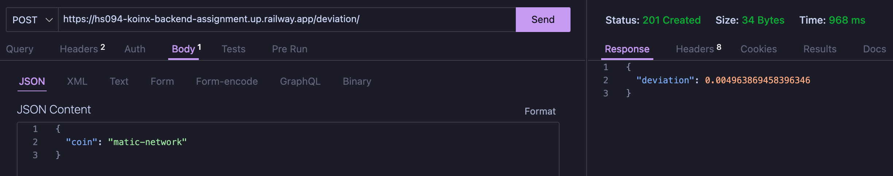
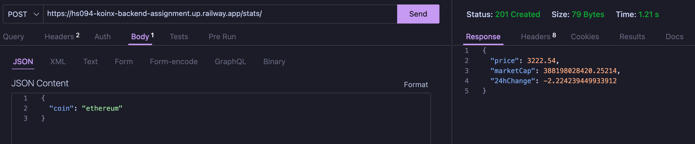

# <div align="center">CryptoFetch Backend Service</div>

> The `crypto-fetch-service` is a NestJS-based backend server that fetches the latest cryptocurrency prices, calculates statistics and deviations, and provides endpoints for retrieving this data.

<!-- TABLE OF CONTENTS -->
<details>
  <summary>Table of Contents</summary>
  <ol>
    <li>
      <a href="#project-description">Project Description</a>
      <ul>
        <li><a href="#background-services">Background Services</a></li>
        <li><a href="#api-endpoints">API Endpoints</a></li>
        <li><a href="#project-structure">Project Structure</a></li>
      </ul>
    </li>
    <li>
      <a href="#getting-started">Getting Started</a>
      <ul>
        <li><a href="#steps-to-run-the-code">Steps to Run the Code</a></li>
        <li><a href="#run-tests">Run Tests</a></li>
        <li><a href="#deployment">Deployment</a></li>
      </ul>
    </li>
  </ol>
</details>

<p align="right">(<a href="#top">back to top</a>)</p>

## Project Description
### Deployment
The Application is Deployed on [**Railway**](https://railway.com/project/9f4cb147-fa48-4cd4-8942-eb47adc0cf1f?environmentId=95c9c3a6-75a7-4e27-8b2c-b054c2f39218). 

### Example

<div style="display: flex; justify-content: space-around;">

  <figure>
    
    <figcaption>A Sample Request made to Deviation Endpoint for matic-network</figcaption>
  </figure>

  <figure>
    
    <figcaption>A Sample Request made to Stats Endpoint for ethereum</figcaption>
  </figure>

</div>


### Background Services

#### Crypto Fetch Service

The Crypto Fetch Service is responsible for fetching the latest cryptocurrency prices from the CoinGecko API. It supports the following coins:
- `bitcoin`
- `matic-network`
- `ethereum`

The service runs every 2 hours and stores the fetched data in a **MongoDB database**.

#### MongoDB Store

The MongoDB Store is used to persist the fetched cryptocurrency data. The data includes:
- Coin ID (`coinId: string`)
- Price in USD (`priceUsd: number`)
- Market Cap in USD (`marketCapUsd: number`)
- 24-hour Change in USD (`change24h: number`)
- Timestamp (`timestamp: Date`)

### API Endpoints

#### 1. Get Latest Stats

**Endpoint:** `/stats`

**Method:** `POST`

**Description:** Fetches the latest statistics for a specified cryptocurrency.

**Request Body:**
```json
{
  "coin": "bitcoin"
}
```

**Response:**
```json
{
  "price": 50000,
  "marketCap": 1000000000,
  "24hChange": 5
}
```

#### 2. Get Deviation

**Endpoint:** `/deviation`

**Method:** `POST`

**Description:** Calculates the standard deviation of the price for a specified cryptocurrency based on the latest 100 records.

**Request Body:**
```json
{
  "coin": "bitcoin"
}
```

**Response:**
```json
{
  "deviation": 1500
}
```
### Project Structure

```
  .env
  .gitignore
  .prettierrc
  nest-cli.json
  package.json
  .eslintrc.js
  README.md
  src/
      app.controller.spec.ts
      app.controller.ts
      app.module.ts
      app.service.ts
      controller/
          deviation.controller.ts
          stats.controller.ts
      crypto-data/
          crypto-data.module.ts
          crypto-data.service.spec.ts
          crypto-data.service.ts
          schemas/
              crypto-data.schema.ts
      main.ts
  test/
      app.e2e-spec.ts
      jest-e2e.json
  tsconfig.build.json
  tsconfig.json
```
* `app.module.ts`: The main module of the application.
* `src/app.controller.ts`: The main controller of the application.
* `src/app.service.ts`: The main service of the application.
* `src/controller/`: Contains the controllers for the API endpoints.
* `src/crypto-data/`: Contains the module, service, and schema for handling cryptocurrency data.
* `src/main.ts`: The entry point of the application.

## Getting Started

### Steps to Run the Code

1. Clone the repository:
```bash
git clone <repository-url>
```
2. Install the dependencies:
```bash
npm install
```
3. Create a `.env` file in the root directory and fill it with the following content:
```plain-text
MONGO_USERNAME=<your-mongodb-username>
MONGO_PASSWORD=<your-mongodb-password>
MONGO_DATABASE=<your-mongodb-database>
COINGECKO_API_URL=https://api.coingecko.com/api/v3/simple/price?x_cg_demo_api_key=
COINGECKO_API_KEY=<your-coingecko-api-key>
PORT=3000
```
4. Start the application:
```bash
npm run start:dev
```
5. The application will be running at http://localhost:3000.

### Run Tests
```bash
# unit tests
npm run test

# e2e tests
npm run test:e2e

# test coverage
npm run test:cov
```
